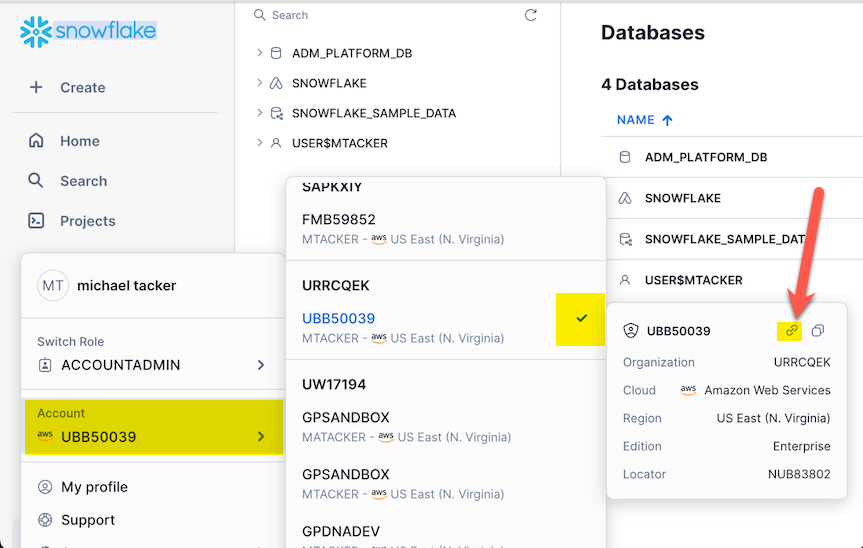
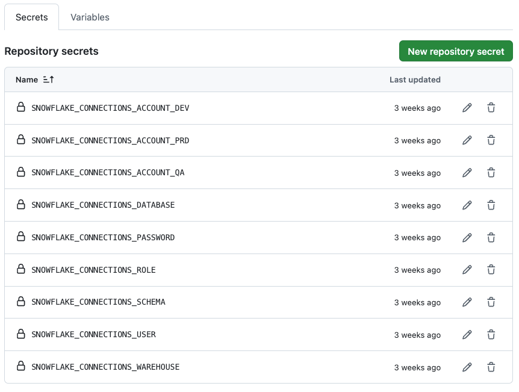
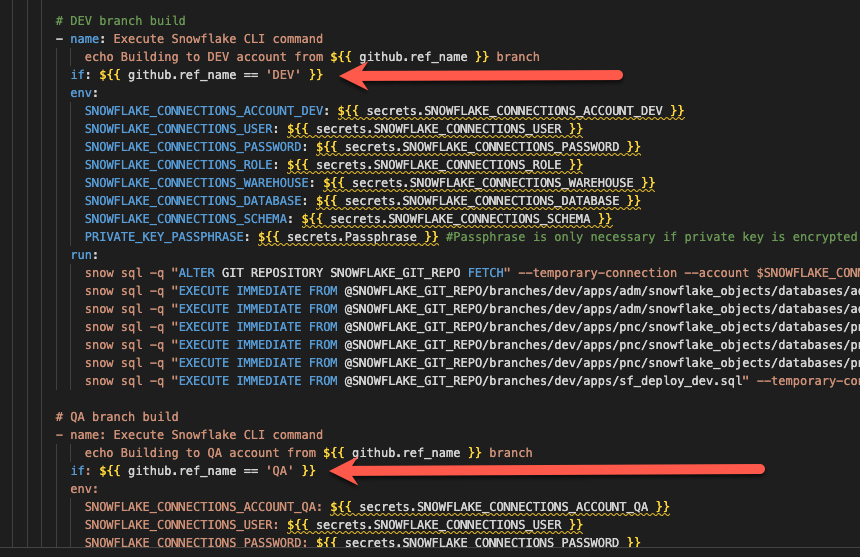

# Enabling CI/CD changes to Snowflake using Github Actions

After completing these steps you will be able to deploy DDL and DML changes direct to multiple Snowflake accounts based upon the commits to each branch. Commits to "DEV" branch will push changes to your "DEV" account (and QA/PRD respectively).  

- See video [The Future Of DevOps With Snowflake](https://www.youtube.com/watch?v=k20yLpW8-xU) covering this deployment model.  
- Refer to [documentation](https://docs.snowflake.com/en/developer-guide/git/git-overview) for more detail on Snowflake integration with Github.  

The deployment model we are building to:  


## Summary of Steps:
1) Create Snowflake Trial Accounts (DEV/QA/PRD)  
2) Laptop configurations (VS Code, Snowflake CLI, git CLI for managing secrets)
3) Create Snowflake database for integration with Github (script provided)   
4) Github setups (create a personal access token)  
5) Configure Snowflake accounts to connect to Github (script provided) 
6) Create an environment file for ease of updating Github secrets  
7) Update git repository with Snowflake account secrets
8) Clone this repo, make code changes (DDL), push to repository and verify your changes are reflected in Snowflake

## Step 1: Create Snowflake trial accounts

### This is a test header.
- Create three [30 day trial accounts](https://signup.snowflake.com/) (DEV/QA/PRD).[^1]   

- Once created, find your Snowflake Account Identifiers (```account_locator.cloud_region```) and save them for later.     

From the Snowflake console:  


Snowflake account URL's are in the form:  
https://```account_locator.cloud_region```.snowflakecomputing.com  


## Step 2: Laptop configurations
- [Install and configure](01_snowflake_cli_setup.md) Snowflake CLI
- [Configure](https://docs.snowflake.com/en/user-guide/vscode-ext) VS Code to connect to Snowflake  

VS Code should now be enabled for Snowflake account access:  


- Install the Github CLI for managing secrets (not required, but makes life easier):  

```
brew install gh 
```

## Step 3: Create Snowflake database for integration with Github 

- Using VS Code or a Snowflake worksheet [run this code](02_build_platform_db.sql) in each Snowflake account. 
- Each Snowflake account should now have a database and compute warehouse called ADM_PLATFORM_DB and ADM_PLATFORM_DB_WH, respectively.

Purpose of this database [^2] 

## Step 4: Remote github repository setups  
- Create a [Fine-grained Personal Access Token](https://docs.github.com/en/authentication/keeping-your-account-and-data-secure/managing-your-personal-access-tokens#fine-grained-personal-access-tokens) so that Snowflake can pull down repository changes.  

## Step 5: Configure Snowflake accounts to connect to Github
Requires Personal Access Token from Step 4

- Using VS Code or a Snowflake worksheet [run this code](03_build_snowflake_local_repo.sql) in each Snowflake account to build your local repository.

## Step 6: Build an environment file for ease of updating Github secrets

```
touch .env
```
Add ```.env``` to gitignore!  

Add connection details to .env file with respective ```account_locator.cloud_region``` IDs:  
~~~~
SNOWFLAKE_CONNECTIONS_ACCOUNT_DEV = csb*****.us-east-1   
SNOWFLAKE_CONNECTIONS_ACCOUNT_QA = frb*****.us-east-1  
SNOWFLAKE_CONNECTIONS_ACCOUNT_PRD = sab*****.us-east-1  
SNOWFLAKE_CONNECTIONS_USER = SVC_DEPLOY  
SNOWFLAKE_CONNECTIONS_PASSWORD = [SF service account pwd] 
SNOWFLAKE_CONNECTIONS_ROLE = ACCOUNTADMIN  
SNOWFLAKE_CONNECTIONS_WAREHOUSE = ADM_PLATFORM_DB_WH  
SNOWFLAKE_CONNECTIONS_DATABASE = ADM_PLATFORM_DB  
SNOWFLAKE_CONNECTIONS_SCHEMA = DEPLOY_SCHEMA  
~~~~
[SF service account pwd] is the password you created in Step 5.  

If you used my database build script then the literal values above should work for you.  Just swap out account and password details with your own.  

## Step 7: Update remote git repository with Snowflake account secrets
Requires Personal Access Token from Step 4  

- Run ```gh``` to write Snowflake account secrets to your repository enabling Github Actions to deploy Snowflake account changes on your behalf:  
```
gh secret set -f - < .env
```
Follow the prompts:   

  

Two things just happened:  
- Your github personal access token is now securely stored locally for command line authentication when updating secrets in the future. [^3]
- Your ```.env``` secrets should now be added to your github repository. 

Verify your secrets were added to the repository:  
  

## You are now enabled to deploy CI/CD (DML/DDL) changes to multiple Snowflake accounts
- Commits, say to your "DEV" branch, will now apply changes to your "DEV" Snowflake account (and QA/PRD etc)  
- Ensure your branch names match what's in [main.yml](/.github/workflows/main.yml):  


## Next steps
Clone this repo and test by making DDL changes and see changes get deployed to your respective accounts.  
NOTE> master branch = PRD for this exercise.  

[^1]: Credit card is not required. Your email address can be reused and a corporate address is not required. 
[^2]: [Snowflake docs on local stage](https://docs.snowflake.com/en/developer-guide/git/git-overview): "*You can integrate your remote Git repository with Snowflake so that files from the repository are synchronized to a special kind of stage called a repository stage. The repository stage acts as a local Git repository with a full clone of the remote repository, including branches, tags, and commits.*"
[^3]: From now on, running ```gh secret set -f - < .env``` will simply update your github secrets without requiring the PAT.  


