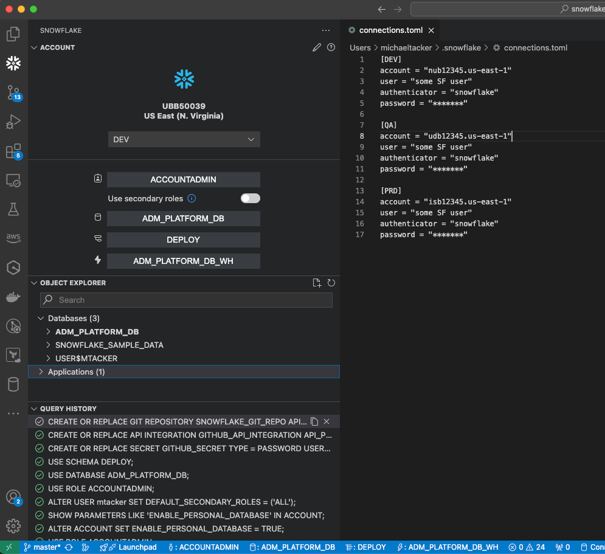
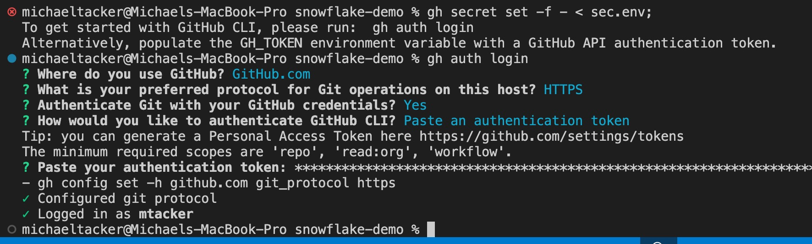
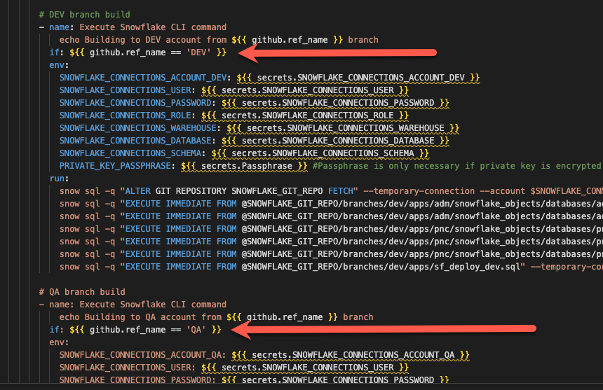

# Enabling CI/CD changes to Snowflake using Github Actions
This is a deployment model is based on Snowflake's most recent recommended approach:  
See [The Future Of DevOps With Snowflake](https://www.youtube.com/watch?v=k20yLpW8-xU).  

After completing these steps you will be able to deploy code DDL and DML changes direct to multiple Snowflake accounts based upon which branch (DEV/QA/PRD) you commit to.  
https://docs.snowflake.com/en/developer-guide/git/git-overview


## Step 1: Create Snowflake trial accounts

- Snowflake Trial account [setup](https://signup.snowflake.com/).  
Create three 30 day accounts (DEV/QA/PRD). Credit card is not required.  
Note> You CAN reuse your email and Snowflake does NOT have to be a corporate address.  

- Find your Snowflake Account Identifiers (```account_locator.cloud_region```) and save them later     

From the Snowflake console:  


Snowflake account URL's are in the form:  
https://```account_locator.cloud_region```.snowflakecomputing.com  

## Laptop setups
- Install the [Snowflake CLI](01_snowflake_cli_setup.md)
- Configure VS Code to connect to Snowflake  
https://docs.snowflake.com/en/user-guide/vscode-ext

VS Code Can Should now be able to connect directly to your Snowflake accounts:  


- Next, install the Github CLI for managing secrets (not required, but makes life easier):  

```
brew install gh 
```

## Create a database for integration with Github 

[About this step](https://docs.snowflake.com/en/developer-guide/git/git-overview):  
"*You can integrate your remote Git repository with Snowflake so that files from the repository are synchronized to a special kind of stage called a repository stage. The repository stage acts as a local Git repository with a full clone of the remote repository, including branches, tags, and commits.*"

This *repository stage* requires us to "prime the pump" by already having an admin database in place, therefore:  
- Using VS Code or a Snowflake worksheet [run this code](00_buiild_platform_db.sql) in each Snowflake account

Your Snowflake account should now have a new database and compute warehouse called ADM_PLATFORM_DB and ADM_PLATFORM_DB_WH respectively.

## Create .env file for ease of updating Github secrets
```
touch .env
```
Add ```.env``` to gitignore!  

Add parameter values with ```SNOWFLAKE_CONNECTIONS_ACCOUNT_[DEV/QA/PRD]``` being each ```account_locator.cloud_region```:  

SNOWFLAKE_CONNECTIONS_ACCOUNT_DEV = csb*****.us-east-1   
SNOWFLAKE_CONNECTIONS_ACCOUNT_QA = frb*****.us-east-1  
SNOWFLAKE_CONNECTIONS_ACCOUNT_PRD = sab*****.us-east-1  
SNOWFLAKE_CONNECTIONS_USER = SVC_DEPLOY  
SNOWFLAKE_CONNECTIONS_PASSWORD = [service account pwd]   
SNOWFLAKE_CONNECTIONS_ROLE = ACCOUNTADMIN  
SNOWFLAKE_CONNECTIONS_WAREHOUSE = ADM_PLATFORM_DB_WH  
SNOWFLAKE_CONNECTIONS_DATABASE = ADM_PLATFORM_DB  
SNOWFLAKE_CONNECTIONS_SCHEMA = DEPLOY_SCHEMA  

## Github setups  
- Create a [Personal Access Token](https://docs.github.com/en/authentication/keeping-your-account-and-data-secure/managing-your-personal-access-tokens#fine-grained-personal-access-tokens)  
Your personal access token will be needed for the next step
- Run ```gh``` to write secrets to your repository  
```
gh secret set -f - < .env
```
Follow the prompts:   

  

Two things just happened:  
- Your github personal access token is now securely stored locally. 
- Your secrets should now be added to your github repository.  
From now on, running ```gh secret set -f - < .env``` will simply update your github secrets without requiring the PAT 

## Lastly, configure your Snowflake accounts to be able to connect to Github
- Using either VS Code or a Snowflake worksheet [run this code](03_build_snowflake_local_repo.sql) in each Snowflake account to build your local repository.

## Github Actions can now deploy CI/CD changes to multiple Snowflake accounts!
- At this point, commits to your "DEV" branch should now apply changes to you "DEV" Snowflake account (QA/PRD etc)  
- Just ensure your branch names match what's in [main.yml](/.github/workflows/main.yml):  



