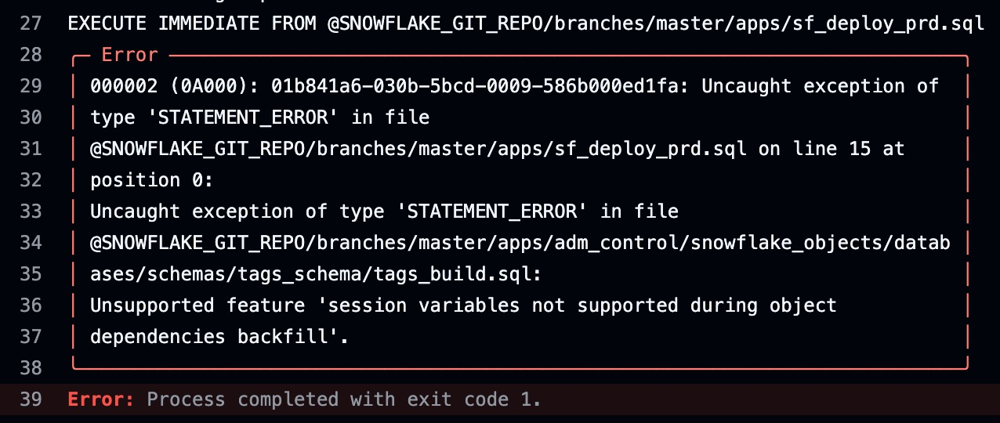
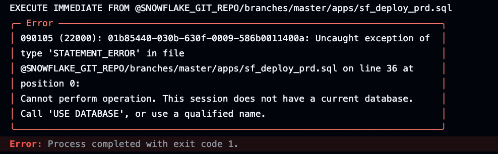
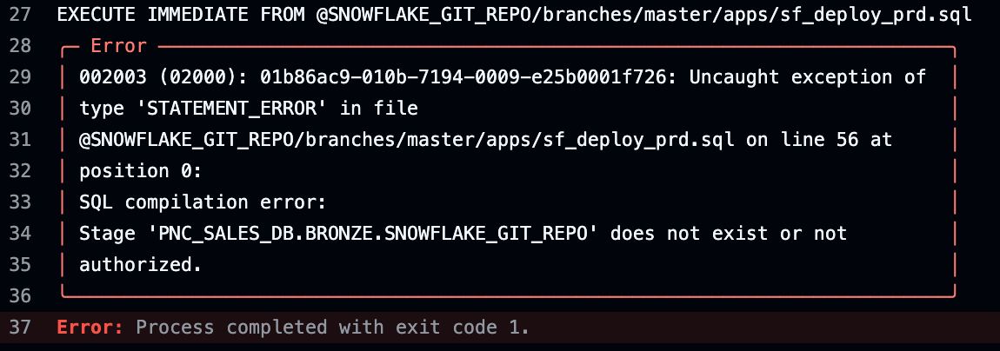

# Problems using EXECUTE IMMEDIATE FROM

The desire is to use Github Actions with "EXECUTE IMMEDIATE FROM" to orchestrate our deployments.  

The issue seems to be around the way in which I'm parameterizing my scripts using SET statements.  My SET statements create variables to give us a level  of abstraction that will support a robust orchestration and deployment model in a multi-user/multi-team environment.

Below are the two different approaches I've tried

## Approach 1
- Include SET variables WITH the build code:

A commit to Github [triggers main.yml](/.github/workflows/main.yml).  main.yml calls:  
&nbsp;&nbsp;&nbsp;&nbsp;&nbsp;&nbsp;&nbsp;&nbsp;&nbsp;&nbsp;&nbsp;&nbsp;&nbsp;&nbsp;&nbsp;[sf_deploy_prd.sql](apps/sf_deploy_prd.sql) calls:  
&nbsp;&nbsp;&nbsp;&nbsp;&nbsp;&nbsp;&nbsp;&nbsp;&nbsp;&nbsp;&nbsp;&nbsp;&nbsp;&nbsp;&nbsp;&nbsp;&nbsp;&nbsp;&nbsp;&nbsp;&nbsp;&nbsp;&nbsp;&nbsp;&nbsp;&nbsp;&nbsp;&nbsp;&nbsp;[tags_build.sql](apps/adm/snowflake_objects/databases/adm_platform_db/schemas/tags/tags_build.sql)  << Fails Here  
&nbsp;&nbsp;&nbsp;&nbsp;&nbsp;&nbsp;&nbsp;&nbsp;&nbsp;&nbsp;&nbsp;&nbsp;&nbsp;&nbsp;&nbsp;&nbsp;&nbsp;&nbsp;&nbsp;&nbsp;&nbsp;&nbsp;&nbsp;&nbsp;&nbsp;&nbsp;&nbsp;&nbsp;&nbsp;[alerts_build.sql](apps/adm/snowflake_objects/databases/adm_platform_db/schemas/alerts/alerts_build.sql)  

## Approach 2
- Separate SET variables FROM the build code:

A commit to Github [triggers main.yml](/.github/workflows/main.yml).  main.yml calls:  
&nbsp;&nbsp;&nbsp;&nbsp;&nbsp;&nbsp;&nbsp;&nbsp;&nbsp;&nbsp;&nbsp;&nbsp;&nbsp;&nbsp;&nbsp;[sf_deploy_prd.sql](apps/sf_deploy_prd.sql) calls:  
&nbsp;&nbsp;&nbsp;&nbsp;&nbsp;&nbsp;&nbsp;&nbsp;&nbsp;&nbsp;&nbsp;&nbsp;&nbsp;&nbsp;&nbsp;&nbsp;&nbsp;&nbsp;&nbsp;&nbsp;&nbsp;&nbsp;&nbsp;&nbsp;&nbsp;&nbsp;&nbsp;&nbsp;&nbsp;[tags_schema.sql](apps/adm/snowflake_objects/databases/adm_platform_db/schemas/tags/tags_schema.sql) calls:  
&nbsp;&nbsp;&nbsp;&nbsp;&nbsp;&nbsp;&nbsp;&nbsp;&nbsp;&nbsp;&nbsp;&nbsp;&nbsp;&nbsp;&nbsp;&nbsp;&nbsp;&nbsp;&nbsp;&nbsp;&nbsp;&nbsp;&nbsp;&nbsp;&nbsp;&nbsp;&nbsp;&nbsp;&nbsp;&nbsp;&nbsp;&nbsp;&nbsp;&nbsp;&nbsp;&nbsp;&nbsp;&nbsp;[build_schema.sql](apps/build_schema.sql)  
&nbsp;&nbsp;&nbsp;&nbsp;&nbsp;&nbsp;&nbsp;&nbsp;&nbsp;&nbsp;&nbsp;&nbsp;&nbsp;&nbsp;&nbsp;&nbsp;&nbsp;&nbsp;&nbsp;&nbsp;&nbsp;&nbsp;&nbsp;&nbsp;&nbsp;&nbsp;&nbsp;&nbsp;&nbsp;[alerts_schema.sql](apps/adm/snowflake_objects/databases/adm_platform_db/schemas/alerts/alerts_schema.sql) calls:  
&nbsp;&nbsp;&nbsp;&nbsp;&nbsp;&nbsp;&nbsp;&nbsp;&nbsp;&nbsp;&nbsp;&nbsp; &nbsp;&nbsp;&nbsp;&nbsp;&nbsp;&nbsp;&nbsp;&nbsp;&nbsp;&nbsp;&nbsp;&nbsp;&nbsp;&nbsp;&nbsp;&nbsp;&nbsp;&nbsp;&nbsp;&nbsp;&nbsp;&nbsp;&nbsp;&nbsp;&nbsp;&nbsp;[build_schema.sql](apps/build_schema.sql)  << Fails here  

## Successful workaround for failing APPROACH 1 & 2

Move EXECUTE IMMEDIATE FROM schema builds from our preferred [sf_deploy_prd.sql](apps/sf_deploy_prd.sql) build script to [main.yml](/.github/workflows/main.yml).  Schemas build if I put EIF calls there! But this separates our build steps and forces us to update 3 places (dev/qa/prd) in main.yml for any new schema. Not ideal.

## Latest issue with EXECUTE IMMEDIATE FROM

In this new (occassional) error, Snowflake seems to forget the schema location of our stage repository.
'.DEPLOY.SNOWFLAKE_GIT_REPO' is the actual location of our local git stage.  But for some reason all of the sudden SF might think it's located in 'PNC_SALES_DB.BRONZE.SNOWFLAKE_GIT_REPO'. "PNC_SALES_DB.BRONZE" is the schema being operated on in the current (failing) step.  

NOTE> Line 56 in the error is now line 67 in the failing script: [sf_deploy_prd.sql](apps/sf_deploy_prd.sql).  It's now line 67 because I added the error text and another FETCH call to see if I can "remind" EXECUTE IMMEDIATE FROM of the correct stage location.  

And just now I had to add a "reminder" of the location of the git stage before the following line that was failing ([note the FETCH above line 70](apps/sf_deploy_prd.sql)). But the last two EXECUTE IMMEDIATE FROM statements in that script finished successfully.  Very odd.  

## Logging question

I need at least basic logging with this EXECUTE IMMEDIATE FROM approach -both fail & success. I get a good clue most times where to look on a failure. But with successes (especially nested EIF calls), all I get is the name of the last step that succeeded. 

Maybe Snowflake Trail? I have not had a chance to see if that gives me anything useful in this case.

Thanks for the assist and any comments about any of this! Especially about my overall approach!