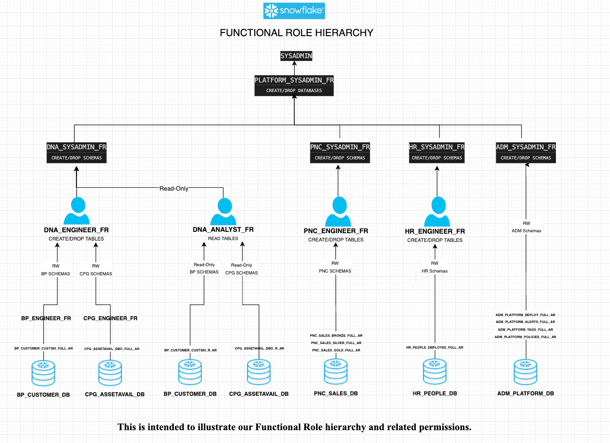

# Proposed framework for managed use of Snowflake demonstrating:  
- RBAC model fully fleshed out using Functional Roles  
- 5 hypothetical databases to illustrate security across multiple teams (i.e. Functional Roles)    
- Use of Github Actions for CI/CD  
- Automated deployments to multiple Snowflake Accounts (DEV/QA/PRD) using Github Secrets  
- Orchestration using Snowflake's new ```EXECUTE IMMEDIATE FROM``` feature  
- Git Integration with Snowflake using a local stage  
---  

## Git Integration with Snowflake using a local stage 
https://docs.snowflake.com/en/developer-guide/git/git-overview


---  
## Segregation of Access Using RBAC    

  

---

## Proposed Directory Structure 

Our proposed directory structure is inpired by the Snowflake Object Hierarchy: 


For Example:  
```
# Change ./apps/[YOUR SEGMENT]/{snowflake_objects/databases/[YOUR DATABASE]/schemas/...
mkdir -p ./apps/adm/{snowflake_objects/databases/adm_platform_db/schemas/alerts/{externalTables,fileFormats,maskingPolicies,pipes,stages,streams,tables,tasks,views,sequences,storedProcedures,udf,streams,tasks},scripts};  
mkdir -p ./apps/adm/{snowflake_objects/databases/adm_platform_db/schemas/tags/{externalTables,fileFormats,maskingPolicies,pipes,stages,streams,tables,tasks,views,sequences,storedProcedures,udf,streams,tasks},scripts};  
```

  

Actual for this repo:   
  

