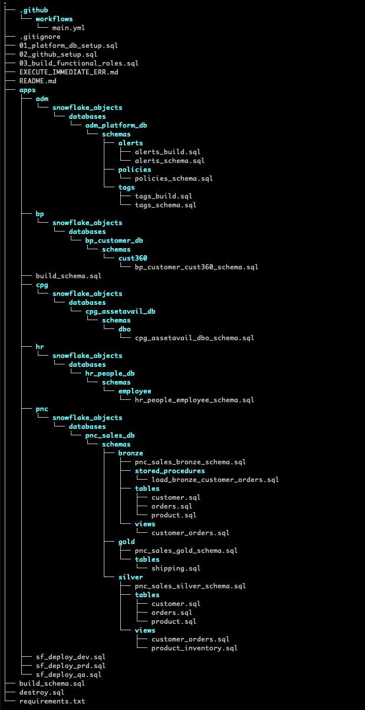

# Platform Prototype for Managed use of Snowflake 

Demonstrating:  
- RBAC model fully fleshed out using Functional Roles.  
- 5 hypothetical databases used to illustrate managed security across multiple teams (via Functional Roles).  
- Use of Github Actions and the Snowflake CLI for CI/CD - (evented by commits to branches).  
- Automated deployments to multiple Snowflake Accounts (dev/qa/prod) using Github Secrets.  
- Orchestration using Snowflake's new ```EXECUTE IMMEDIATE FROM``` feature.  
- Git Integration with Snowflake using a local stage.  

Deployment model is based on Snowflake's most recent recommended approach:  
See [The Future Of DevOps With Snowflake](https://www.youtube.com/watch?v=k20yLpW8-xU).  
  
## ToDo  
Add:  
- Snowflake Managed Schemas  
- Framework for notifications and alerts  
- Basic framework for tagging  
- Example of how to do masking (column/row)  
---  

## Git Integration with Snowflake using a local stage 
https://docs.snowflake.com/en/developer-guide/git/git-overview


---  
## Segregation of Access Using RBAC    

  

---

## Proposed Directory Structure 

Our proposed directory structure is inpired by the Snowflake Object Hierarchy: 


For Example:  
```
# Change ./apps/[YOUR SEGMENT]/{snowflake_objects/databases/[YOUR DATABASE]/schemas/...
mkdir -p ./apps/adm/{snowflake_objects/databases/adm_platform_db/schemas/alerts/{external_tables,file_formats,masking_policies,pipes,stages,streams,tables,tasks,views,sequences,stored_procedures,udf,streams,tasks},scripts};  
mkdir -p ./apps/adm/{snowflake_objects/databases/adm_platform_db/schemas/tags/{external_tables,file_formats,masking_policies,pipes,stages,streams,tables,tasks,views,sequences,stored_procedures,udf,streams,tasks},scripts};  
```

  
 

 

