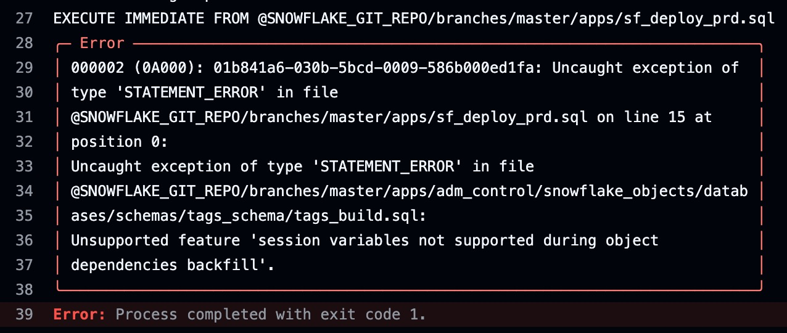

# Problems using EXECUTE IMMEDIATE FROM

- The desire is to use Github Actions with "EXECUTE IMMEDIATE FROM" to orchestrate our deployments.  

The issue seems to be around the way in which I'm parameterizing my scripts using SET statements.  My SET statements create variables to give us a level  of abstraction that will support a robust orchestration and deployment model in a multi-user/multi-team environment.

- Below are the two different approaches I've tried

## Approach 1
- Include SET variables WITH the build code:

A commit to Github [triggers main.yml](/.github/workflows/main.yml).  main.yml calls:  
&nbsp;&nbsp;&nbsp;&nbsp;&nbsp;&nbsp;&nbsp;&nbsp;&nbsp;&nbsp;&nbsp;&nbsp;&nbsp;&nbsp;&nbsp;[sf_deploy_prd.sql](apps/sf_deploy_prd.sql) calls:  
&nbsp;&nbsp;&nbsp;&nbsp;&nbsp;&nbsp;&nbsp;&nbsp;&nbsp;&nbsp;&nbsp;&nbsp;&nbsp;&nbsp;&nbsp;&nbsp;&nbsp;&nbsp;&nbsp;&nbsp;&nbsp;&nbsp;&nbsp;&nbsp;&nbsp;&nbsp;&nbsp;&nbsp;&nbsp;[tags_build.sql](apps/adm_control/snowflake_objects/databases/adm_control_db/schemas/tags/tags_build.sql)  << Fails Here  
&nbsp;&nbsp;&nbsp;&nbsp;&nbsp;&nbsp;&nbsp;&nbsp;&nbsp;&nbsp;&nbsp;&nbsp;&nbsp;&nbsp;&nbsp;&nbsp;&nbsp;&nbsp;&nbsp;&nbsp;&nbsp;&nbsp;&nbsp;&nbsp;&nbsp;&nbsp;&nbsp;&nbsp;&nbsp;[alerts_build.sql](apps/adm_control/snowflake_objects/databases/adm_control_db/schemas/alerts/alerts_build.sql)  




## Approach 2
- Separate SET variables FROM the build code:

A commit to Github [triggers main.yml](/.github/workflows/main.yml).  main.yml calls:  
&nbsp;&nbsp;&nbsp;&nbsp;&nbsp;&nbsp;&nbsp;&nbsp;&nbsp;&nbsp;&nbsp;&nbsp;&nbsp;&nbsp;&nbsp;[sf_deploy_prd.sql](apps/sf_deploy_prd.sql) calls:  
&nbsp;&nbsp;&nbsp;&nbsp;&nbsp;&nbsp;&nbsp;&nbsp;&nbsp;&nbsp;&nbsp;&nbsp;&nbsp;&nbsp;&nbsp;&nbsp;&nbsp;&nbsp;&nbsp;&nbsp;&nbsp;&nbsp;&nbsp;&nbsp;&nbsp;&nbsp;&nbsp;&nbsp;&nbsp;[tags.sql](apps/adm_control/snowflake_objects/databases/adm_control_db/schemas/tags/tags.sql) calls:  
&nbsp;&nbsp;&nbsp;&nbsp;&nbsp;&nbsp;&nbsp;&nbsp;&nbsp;&nbsp;&nbsp;&nbsp;&nbsp;&nbsp;&nbsp;&nbsp;&nbsp;&nbsp;&nbsp;&nbsp;&nbsp;&nbsp;&nbsp;&nbsp;&nbsp;&nbsp;&nbsp;&nbsp;&nbsp;&nbsp;&nbsp;&nbsp;&nbsp;&nbsp;&nbsp;&nbsp;&nbsp;&nbsp;[build_schema.sql](apps/build_schema.sql)  
&nbsp;&nbsp;&nbsp;&nbsp;&nbsp;&nbsp;&nbsp;&nbsp;&nbsp;&nbsp;&nbsp;&nbsp;&nbsp;&nbsp;&nbsp;&nbsp;&nbsp;&nbsp;&nbsp;&nbsp;&nbsp;&nbsp;&nbsp;&nbsp;&nbsp;&nbsp;&nbsp;&nbsp;&nbsp;[alerts.sql](apps/adm_control/snowflake_objects/databases/adm_control_db/schemas/alerts/alerts.sql) calls:  
&nbsp;&nbsp;&nbsp;&nbsp;&nbsp;&nbsp;&nbsp;&nbsp;&nbsp;&nbsp;&nbsp;&nbsp; &nbsp;&nbsp;&nbsp;&nbsp;&nbsp;&nbsp;&nbsp;&nbsp;&nbsp;&nbsp;&nbsp;&nbsp;&nbsp;&nbsp;&nbsp;&nbsp;&nbsp;&nbsp;&nbsp;&nbsp;&nbsp;&nbsp;&nbsp;&nbsp;&nbsp;&nbsp;[build_schema.sql](apps/build_schema.sql)  << Fails here  


<!-- ## Database Notes
 -->

## Logging question

I need at least basic logging with this EXECUTE IMMEDIATE FROM approach -both fail & success. I get a good clue most times where to look on a failure. But with successes (especially nested EIF calls), all I get is the name of the last step that succeeded. 

Maybe Snowflake Trail? I have not had a chance to see if that gives me anything useful in this case.

Thanks for the assist and any comments about any of this! Especially about my overall approach!

--------------------------------------------------------------  
## Directory Structure 


<!-- ```
mkdir -p ./apps/pnc_sales/{snowflake_objects/databases/pnc_sales_db/schemas/alerts/{externalTables,fileFormats,maskingPolicies,pipes,stages,streams,tables,tasks,views,sequences,storedProcedures,udfs,streams,tasks},scripts};  
``` -->

Our proposed directory structure is inpired by the Snowflake Object Hierarchy:  


For Example:  


Actual for this repo:


