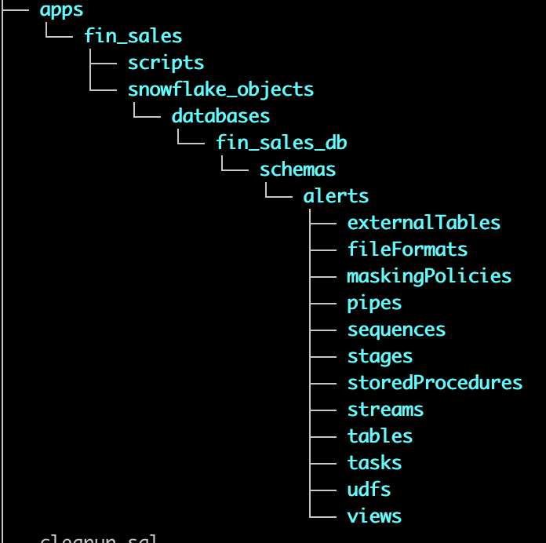

# This repo intends to demonstrate the following  
- RBAC/Security Model using Custom Roles together with Functional Roles  
- Use of Github Actions for CI/CD  
- Automated deployments to multiple Snowflake Accounts (DEV/QA/PRD) via Github Secrets  
- Orchestration using Snowflake's new ```EXECUTE IMMEDIATE FROM``` feature  
- Git Integration with Snowflake using a repository stage  

## Use of Git repository in Snowflake
<p align="center">
    
</p>

## Current RBAC Model
<p align="center">
    
</p>

--------------------------------------------------------------  
## Directory Structure 


<!-- ```
mkdir -p ./apps/pnc_sales/{snowflake_objects/databases/pnc_sales_db/schemas/alerts/{externalTables,fileFormats,maskingPolicies,pipes,stages,streams,tables,tasks,views,sequences,storedProcedures,udfs,streams,tasks},scripts};  
``` -->

Our proposed directory structure is inpired by the Snowflake Object Hierarchy:  


For Example:  


Actual for this repo:


